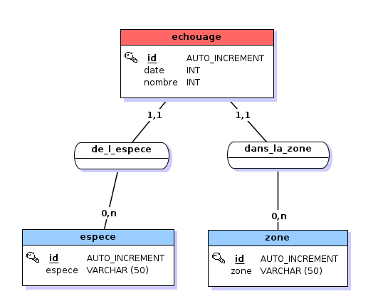

# projet_framework_cir3

# Livrables
Vous devez fournir les éléments suivants en livraison de votre projet :
 - l’ensemble des sources (code React, code Symfony et export complet de 
la base de données)
 - une documentation :
   - décrivant le modèle de bdd et les modifications éventuelles réalisées
   - les virtualhost utilisés (fournir le(s) fichiers de virtualhost)
   - les urls utilisées
   - le format d’accès à l’api et le format de retour
 - le code doit être commenté

# Modèles de la base de données
## tables
```
+----------------------------+
| Tables_in_projet_framework |
+----------------------------+
| echouage                   |
| espece                     |
| zone                       |
+----------------------------+
```
Table **echouage** :
```
+-----------+------+------+-----+---------+----------------+
| Field     | Type | Null | Key | Default | Extra          |
+-----------+------+------+-----+---------+----------------+
| id        | int  | NO   | PRI | NULL    | auto_increment |
| date      | int  | NO   |     | NULL    |                |
| nombre    | int  | NO   |     | NULL    |                |
| zone_id   | int  | YES  | MUL | NULL    |                |
| espece_id | int  | YES  | MUL | NULL    |                |
+-----------+------+------+-----+---------+----------------+
```
Table **espece** :
```
+--------+-------------+------+-----+---------+----------------+
| Field  | Type        | Null | Key | Default | Extra          |
+--------+-------------+------+-----+---------+----------------+
| id     | int         | NO   | PRI | NULL    | auto_increment |
| espece | varchar(50) | NO   |     | NULL    |                |
+--------+-------------+------+-----+---------+----------------+
```
Table **zone** :
```
+-------+-------------+------+-----+---------+----------------+
| Field | Type        | Null | Key | Default | Extra          |
+-------+-------------+------+-----+---------+----------------+
| id    | int         | NO   | PRI | NULL    | auto_increment |
| zone  | varchar(50) | NO   |     | NULL    |                |
+-------+-------------+------+-----+---------+----------------+
```
## relations


# virtualhosts créés

# urls utilisés
## back
### Accueil
 - **/** : accueil du back et menu de recherche
 - **/recherche?zone=`{zone_id}`&espece=`{espece_id}`** : recherche d'une espèce dans une zone sélectionnée
   - zone_id: l'identifiant de la zone, ou 0 pour toutes les zones
   - espece_id : l'identifiant de l'espèce

### Échouages
 - **/echouage** : liste des échouages
 - **/echouage/new** : ajouter un échouage
 - **/echouage/`{id}`** : détails d'un échouage
 - **/echouage/`{id}`/edit** : modifier un échouage

### Espèces
 - **/espece** : liste des espèces
 - **/espece/new** : ajouter une espèce
 - **/espece/`{id}`** : détails d'une espèce
 - **/espece/`{id}`/edit** : modifier une espèce

### Zones
 - **/zone** : liste des zones
 - **/zone/new** : ajouter une zone
 - **/zone/`{id}`** : détails d'une zone
 - **/zone/`{id}`/edit** : modifier une zone

## Web service

### Accueil de l'API
 - **/api** : liste des endpoints

### échouages groupés par date
 - **/api/echouages/espece/`{espece_id}`** : tous les échouages d'une espèce groupés par date
 - **/api/echouages/espece/`{espece_id}`/zone/`{zone_id}`** : tous les échouages d'une espèce dans une zone groupés par date

### échouages groupés par date et affichés par zone
 - **/api/echouages/espece/`{espece_id}`/zones/date** tous les échouages d'une espsèce groupés par date et affichés par zone
 - **/api/echouages/espece/`{espece_id}`/zone/`{zone_id}`/date** tous les échouages d'une espèce dans une zone groupés par date et affichés par zone
 - **/api/echouages/espece/`{espece_id}`/zones/date/`{min}`/`{max}`** les échouages d'une espsèce pour chaque date parmi les dates minimales et maximales groupés par date et affichés par zone
 - **/api/echouages/espece/`{espece_id}`/zone/`{zone_id}`/date/`{min}`/`{max}`** les échouages d'une espèce dans une zone pour chaque date parmi les dates minimales et maximales groupés par date et affichés par zone

## Espèces
 - **/api/espece** : liste des espèces
 - **/api/espece/`{espece_id}`** : détails d'une espèce
 - **/api/espece/`{espece_id}`/date/** liste des dates où il y a eu un échouage pour cette espèce
 - **/api/espece/`{espece_id}`/date/min** date la plus vielle d'un échouage de cette espèce
 - **/api/espece/`{espece_id}`/date/min** date la plus récente d'un échouage de cette espèce

## Zones
 - **/api/zone** : liste des zones
 - **/api/zone/`{zone_id}`** : détails d'une zone